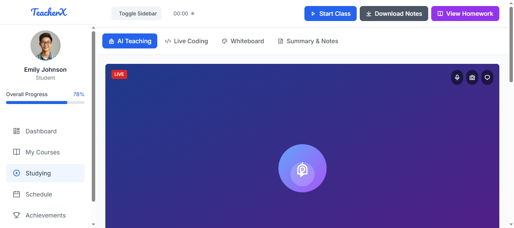
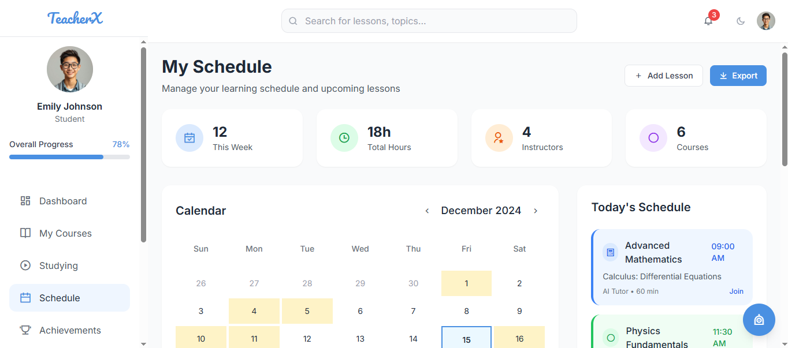

# 🎓 TeacherX - AI-Powered Education Platform

A responsive full-stack AI-powered education platform designed for desktop and mobile, featuring multilingual support, voice-enabled interactions, and intelligent learning tools.

### Home Page


### Studying Page


### Schedule Page

## ✨ Features

### 🧠 AI-Powered Learning
- **Intelligent Chat Assistant** - ChatGPT-like interface with code support
- **Voice Recognition** - Web Speech API integration for hands-free learning
- **Multilingual Support** - English, Hindi, and Telugu
- **Personalized Recommendations** - AI-driven lesson suggestions

### 📚 Learning Tools
- **Interactive Whiteboard** - Canvas-based drawing with AI diagrams
- **Code Editor** - Monaco Editor with AI assistance
- **Markdown Notes** - Rich text editor with voice playback
- **Smart Scheduling** - Calendar integration with drag-and-drop

### 🎯 Gamification
- **XP System** - Earn experience points for completed lessons
- **Achievement Badges** - Unlock badges and streaks
- **Progress Tracking** - Visual progress indicators
- **Daily Goals** - Set and track learning objectives

### 🎨 Modern UI/UX
- **Responsive Design** - Works seamlessly on desktop and mobile
- **Dark/Light Mode** - Theme switching with smooth transitions
- **Smooth Animations** - Framer Motion powered interactions
- **Accessibility** - WCAG compliant design

## 🚀 Tech Stack

- **Frontend**: React 19 + Vite
- **Styling**: Tailwind CSS
- **State Management**: Zustand
- **Routing**: React Router DOM
- **Animations**: Framer Motion
- **Icons**: Lucide React
- **Code Editor**: Monaco Editor
- **Calendar**: FullCalendar
- **Markdown**: React Markdown + Remark GFM
- **Voice**: Web Speech API

## 📦 Installation

1. **Clone the repository**
   ```bash
   git clone <repository-url>
   cd teacherx
   ```

2. **Install dependencies**
   ```bash
   npm install
   ```

3. **Start the development server**
   ```bash
   npm run dev
   ```

4. **Open your browser**
   Navigate to `http://localhost:5173`

## 🏗️ Project Structure

```
teacherx/
├── src/
│   ├── components/          # Reusable UI components
│   │   ├── ChatBubble.jsx
│   │   ├── LessonCard.jsx
│   │   ├── NoteCard.jsx
│   │   └── VoiceButton.jsx
│   ├── hooks/              # Custom React hooks
│   │   ├── useVoiceInput.js
│   │   ├── useLessonProgress.js
│   │   └── useScheduleSync.js
│   ├── pages/              # Page components
│   │   ├── LoginPage.jsx
│   │   ├── HomeDashboard.jsx
│   │   ├── ChatAssistant.jsx
│   │   ├── Schedule.jsx
│   │   ├── Notebook.jsx
│   │   ├── CodePanel.jsx
│   │   ├── Whiteboard.jsx
│   │   ├── Achievements.jsx
│   │   └── Settings.jsx
│   ├── stores/             # Zustand state stores
│   │   ├── lessonStore.js
│   │   └── userSettingsStore.js
│   ├── utils/              # Utility functions
│   ├── assets/             # Static assets
│   ├── App.jsx             # Main app component
│   └── main.jsx            # App entry point
├── public/                 # Public assets
├── tailwind.config.js      # Tailwind configuration
├── package.json            # Dependencies
└── README.md              # This file
```

## 🎮 Usage

### Getting Started
1. **Login** - Use the demo account or create your own
2. **Choose Language** - Select from English, Hindi, or Telugu
3. **Pick Avatar** - Choose your learning persona
4. **Set Theme** - Toggle between light and dark modes

### Core Features

#### 🏠 Dashboard
- Welcome card with personalized greeting
- XP progress and daily goals
- Quick access to all learning tools
- Recommended lessons based on your progress

#### 💬 Chat Assistant
- AI-powered conversation interface
- Voice input and output support
- Code block rendering with syntax highlighting
- Save conversations to notes

#### 📅 Schedule
- Calendar view with lesson planning
- Drag-and-drop lesson scheduling
- Progress tracking and reminders
- Integration with learning goals

#### 📓 Notebook
- Markdown editor with rich formatting
- Voice-to-text functionality
- Auto-save and organization
- Tag and folder system

#### 🖥️ Code Panel
- Monaco Editor integration
- AI code assistance
- Real-time syntax checking
- Integrated terminal

#### 🎨 Whiteboard
- Canvas-based drawing tools
- AI-generated diagrams
- Voice explanations
- Save to notes functionality

## 🎯 Learning Paths

### Beginner
- Start with basic concepts
- Complete foundational lessons
- Build confidence with interactive tools

### Intermediate
- Dive deeper into subjects
- Practice with coding challenges
- Use advanced features like whiteboard

### Advanced
- Custom learning paths
- Complex problem solving
- Mentor other learners

## 🌟 Key Features in Detail

### Voice Integration
- **Speech Recognition**: Convert speech to text
- **Text-to-Speech**: AI voice responses
- **Voice Commands**: Navigate with voice
- **Multilingual Voice**: Support for multiple languages

### AI Assistance
- **Smart Recommendations**: Personalized lesson suggestions
- **Code Analysis**: AI-powered code review
- **Concept Explanation**: Break down complex topics
- **Progress Optimization**: Adaptive learning paths

### Responsive Design
- **Mobile-First**: Optimized for mobile devices
- **Tablet Support**: Enhanced tablet experience
- **Desktop Optimization**: Full-featured desktop interface
- **Touch-Friendly**: Gesture support for mobile

## 🔧 Configuration

### Environment Variables
Create a `.env` file in the root directory:

```env
VITE_APP_NAME=TeacherX
VITE_API_URL=your-api-url
VITE_AI_SERVICE_KEY=your-ai-service-key
```

### Customization
- **Themes**: Modify `tailwind.config.js` for custom colors
- **Animations**: Adjust Framer Motion settings
- **Voice**: Configure Web Speech API settings
- **Storage**: Customize Zustand persistence

## 🚀 Deployment

### Build for Production
```bash
npm run build
```

### Deploy to Vercel
```bash
npm install -g vercel
vercel
```

### Deploy to Netlify
```bash
npm run build
# Upload dist/ folder to Netlify
```

## 🤝 Contributing

1. Fork the repository
2. Create a feature branch (`git checkout -b feature/amazing-feature`)
3. Commit your changes (`git commit -m 'Add amazing feature'`)
4. Push to the branch (`git push origin feature/amazing-feature`)
5. Open a Pull Request

## 📝 License

This project is licensed under the MIT License - see the [LICENSE](LICENSE) file for details.

## 🙏 Acknowledgments

- **React Team** - For the amazing framework
- **Tailwind CSS** - For the utility-first CSS framework
- **Framer Motion** - For smooth animations
- **Lucide** - For beautiful icons
- **Monaco Editor** - For the code editing experience

## 📞 Support

- **Documentation**: [Link to docs]
- **Issues**: [GitHub Issues](https://github.com/your-repo/issues)
- **Discussions**: [GitHub Discussions](https://github.com/your-repo/discussions)
- **Email**: support@teacherx.com

---

**Made with ❤️ for learners worldwide**
